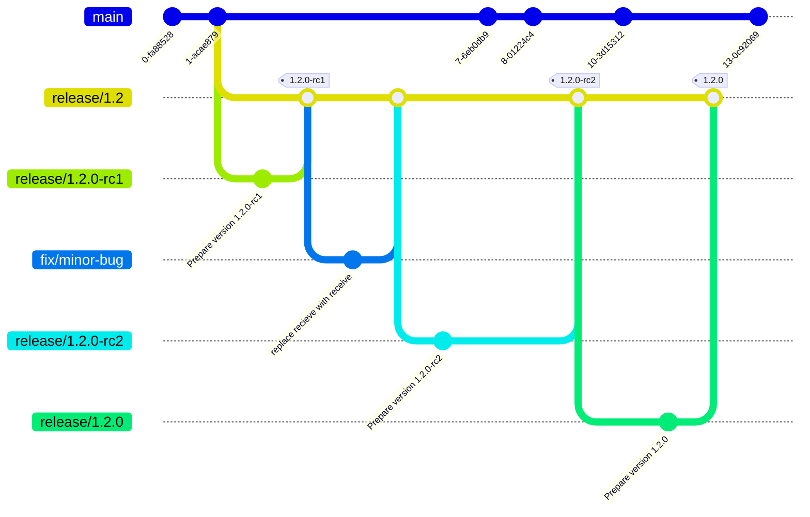
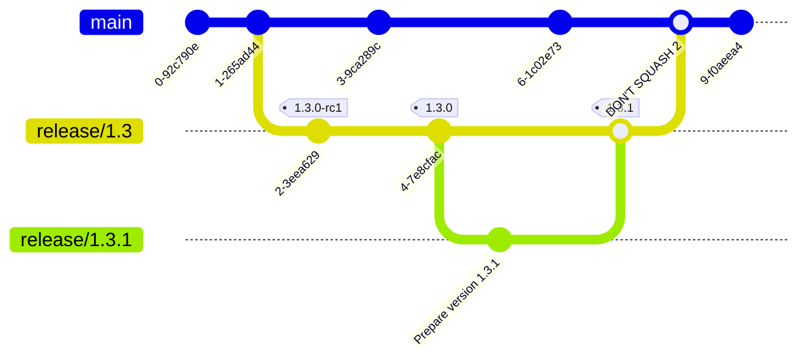
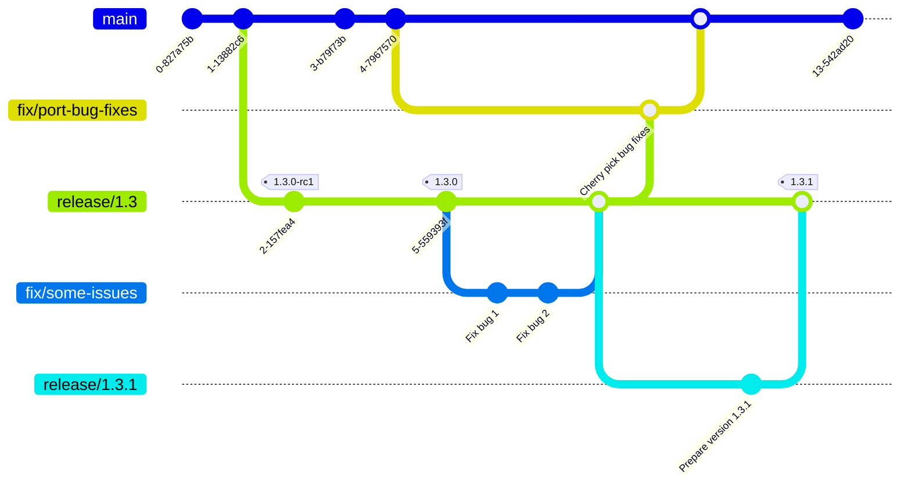

# 👥 Contributing

## 🙋 How can I contribute to the code base?

Follow a feature branching strategy.
For each contribution to the `main` branch just follow these steps:

1. Create locally a branch off of `main` with an appropriate prefix:
    * `feature/` for a new functionality or even just an improvement
    * `fix/` specifically for bug fixes
    * `docs/` to edit documentation only
2. Commit and push to the corresponding Github branch, e.g. `/origin/feature/my-feature`
3. Open a PR from your branch to `main`
4. Once reviewed and approved, *SQUASH AND MERGE* the branch onto `main`
    * squashing creates a single clean commit on `main` reducing the noise and
    making the `main` branch much more readable in the long term

## 🔖 How do I prepare a release?

Standardizing our releases helps in the long term to have consistent
version names and changelogs. This prevents people from reinventing
the wheel for each project/repo.

Also we want to consistently hardcode the version number in each
component in a way that can be accessible once deployed to make
it easy to identify the running version. For example we want the
python apps to show the version number in /health/details.

### How do I choose the right version?

We follow the [Semantic Versioning](https://semver.org/) for releases.
Therefore there are 3 types of release:

* A **Major** release when the major version number is bumped up
    * e.g. 2.Y.Z -> 3.0.0
* A **Minor** release when the minor version number is bumped up
    * e.g. X.3.Z -> X.4.0
* A **Patch** release when the patch version number is bumped up
    * e.g. X.Y.4 -> X.Y.5

Only tags are deployed to the staging and production environments
hence the importance of releases and proper versioning.

#### Why and when do we need Release Candidates?

Even though the `main` branch works fine in QA, it is important
to go through the deployment of a tagged version of the code
onto a staging environment similar to production before making a *major* or *minor* release.
Just this process can reveal issues previously unseen in the QA environment.
This is the role of the release candidate or candidates.

1. Make a Release Candidate (`rc`) tag, e.g. `1.1.0-rc1` prior to the official release
    * Select "This is a pre-release" if you make a Github release (not required)
2. Test the RC on the STG Environment
    * If you find an issue, fix it and make another release candidate, e.g. `-rc2`, to test the fix
3. After verifying the latest `rc` is good, make a release.

**Note**: No need for release candidates for *patch* releases.
We can just bump to the next patch version if an issue is found in the current patch release being tested on staging.

### How do I prepare a release?

Because making a release is preparing a deployment to production, it
is best to follow a standard guaranteeing proper bookkeeping and review process.

The general steps ares:

1. Follow a *release branching strategy* once `main` is ready for a major or
minor release
2. Edit the code to *hardcode the version number* and get this reviewed
3. Create a tag and a *Github release*

#### What is the release branching strategy?

While releases are often straight forward with one tag, no patch version,
on the `main` branch and with just a couple of devs on the repo, things can get
dicey when one makes a release yet the development continues on `main`,
bugs are found, and hotfixes and patch releases are issued.

The release branching strategy isolate the code and changes of each
major and minor release on top of tagging, preventing to have to figure out what changes
happened on the release, and which one was for the next major version.

The basic idea is to create a branch called `release/X.Y` when you
want to release `release/X.Y.0`. This branch will follow the evolution
of the release from the release candidates labelled `Y.X.Y-rcR` but also
all the patch versions of `X.Y`.

See below for a visual example.

### What do I need to do to make the Github release?

Making releases documents what exact version of the code is pushed live.
To understand the differences between versions it is important to have a
clear changelog and release notes.
Finally storing the version in the appropriate files in each project
can help identify the live version if the code is set to display this
hardcoded version somewhere. (e.g. python apps show it at `/health/details`)

1. Create branch `release/X.Y.Z` off of the `release/X.Y` branch
2. Change the version in the version files of the projects in the repo
    * Run `./set_version X.Y.Z`
    * Or change the files manually:
        1. **For python apps**, edit `pyproject.toml` and `__version__.py` files
        2. **For themes**, edit `/config/settings_schema.json` and set the `theme_version` field
3. Commit to git
4. Open a PR for other codeowners to review
5. Once approved, squash and merge `release/X.Y.Z` onto `release/X.Y`
6. [Create the release in Github](https://docs.github.com/en/repositories/releasing-projects-on-github/managing-releases-in-a-repository) on the branch `release/X.Y`
    * Generate the changelog using Github's [automatically generated release notes](https://docs.github.com/en/repositories/releasing-projects-on-github/automatically-generated-release-notes)
    * Feel free to reorganize the changelog entries in sections, maybe by project, types of change, team (BE vs FE) or contributor. Up to you.

### Should I merge the whole release branch into `main`?

It depends.
The `release/X.Y` branch is to isolate code specific to this release and in particular the hardcoding of the version numbers.
So if your are patching a release `1.4.x` while main is getting ready to deploy `2.0.0`, then it's best to not merge.
However if the main branch is not under active development, then merging **WITHOUT SQUASHING** the release branch into `main` is fine.

See below to find out how to handle these two situations.

## 🔙 How do I port bug fixes from a release branch to `main`?

There are two options for two different use cases:
1. If the `main` branch is not active and the release branch and `main` branch haven't diverged much, or multiple releases are live, then use **option 1**.
2. If the `main` branch has been under significant development and has diverged from the release branch, then use **option 2**.

In both cases you should go through a pull request because only reviewed commits should be pushed to `main`, even bug fixes already part of a patch version of a release.
### Option 1: Merge **WITHOUT SQUASHING** the release branch into `main`

This is rather simple and effective as long as you **DO NOT SQUASH**.
Squashing is really a problem only if you add more patch releases to your release branch but since we do not know the future, never squash a release branch onto master and you'll be safe.

### Option 2: Cherry pick the commits from the release branch

This is more of a fancy approach but it's good to know about it in case multiple releases are live.

To achieve that you need to `cherry-pick` the commit or commits fixing
the bug or bugs from the release candidate onto a `fix/` branch from `main`.
Then follow the standard review procedure and squash and merge these fixes
into `main`.

See how the bug fixes for the release `1.3.1` are brought over to `main`:

This can happen anytime, independently of releases, i.e. you may want to wait
for multiple bugs before porting to `main` or do it as soon as possible.
